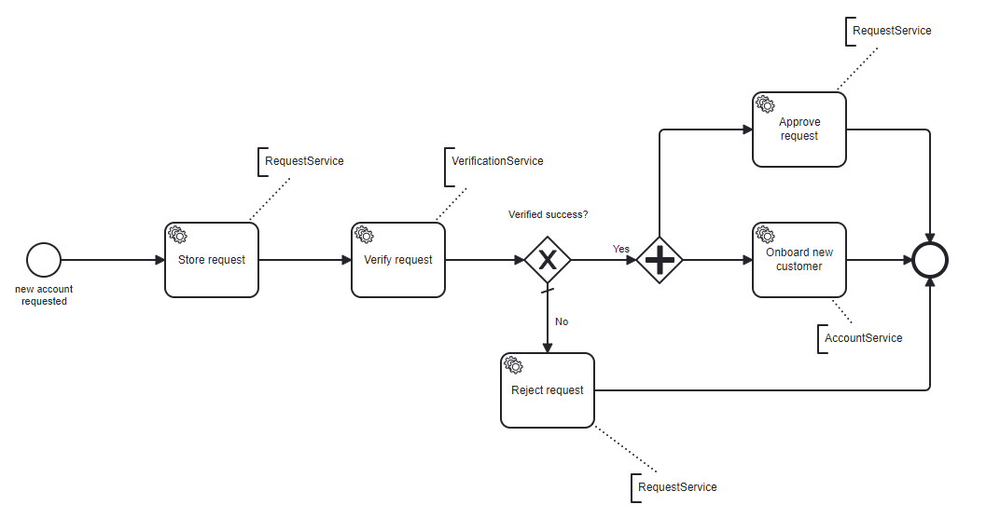

# Introduction

This project implemented a demo using Camunda as an orchestrater in micro-services environment with an KYC process example. 
This project simulates an micro-service based system with four services: 
- Request management service
- Verification service
- Account management service
- Orchestrater service
Each service contains some REST APIs implemented at _src/main/java/com/thoainguyen/rest_




## Tech stack

JDK 11, Gradle, Spring boot, Spring Feign, Spring Camunda Web app

## How to get started?
You can easily start this project via below gradle commands:
```shell
gradle build
gradle bootRun
```
The KYC process is stored at _src/main/resources/kyc.bpmn_, after starting this project, the kyc.bpmn will be deployed to Camunda automatically together
with Camunda tools: TaskList, Cockpit and Admin. 

Each task in the KYC bpmn is mapped with a Java service in _src/main/java/com/thoainguyen/service which calls an API requests to corresponding service
using Spring Feign.

You can access to Camunda TaskList to start a process http://localhost:8080/camunda/app/tasklist/default/#. 
Then click Start process button on the header menu and select kcy process. 
It will ask you input a business key which is the user name need to be verified. 

If you enter **'thoainguyen'**, the process will go to the sucess flow to onboard new customer and approve the request.
Otherwise, it will go to the reject flow.